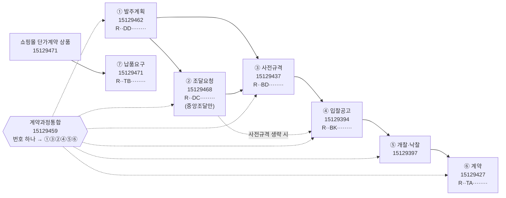
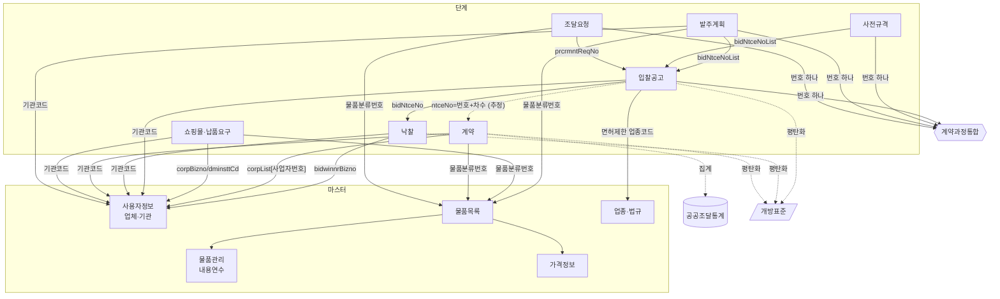

# 조달청 공공조달 API 패밀리 — 역할과 관계

> 원본 그래프: [family.yaml](family.yaml) · 오퍼레이션 전체: [operations.md](operations.md) · 표준: [../README.md](../README.md)
> 작성 2026-09-28 · 근거: 조달청 OpenAPI 참고자료 18종(docx) + 포털 Swagger + 조달청 업무처리절차
> 상태: **documented** — 문서 근거로 정리한 단계. 실제 호출로 값이 이어지는지 확인하는 것은 Phase 2 (`inferred` 표시 항목 우선).

## 1. 한 줄 요약

공공기관이 무언가를 사는 전 과정을 조달청이 **단계별 API로 쪼개** 제공한다. 각 단계는 **차세대 나라장터 통합번호**로 이어지고, **계약과정통합공개서비스(15129459)**가 번호 하나로 전 과정을 이어주는 허브다. 이 구조를 모르면 18개 API가 따로 노는 것처럼 보인다.

## 2. 업무 흐름과 API 대응

| 단계 | 무엇 | API | 선행 조건 |
| --- | --- | --- | --- |
| ① 발주계획 | 기관이 올해 살 것의 분기별 계획 (예산·발주월·방법) | 발주계획현황 15129462 | — |
| ② 조달요청 | 기관이 조달청에 계약을 맡김 (중앙조달) | 조달요청 15129468 | 중앙조달일 때만. 자체조달 기관은 없음 |
| ③ 사전규격 | 입찰 전 규격서 초안 공개, 업체 의견 | 사전규격 15129437 | 법령상 공개 대상일 때만 |
| ④ 입찰공고 | 최종 조건 공고 + 기초금액·면허제한·지역제한 | 입찰공고 15129394 | — |
| ⑤ 개찰·낙찰 | 개찰 순위, 최종낙찰자, 예비가격 | 낙찰 15129397 | 공고의 개찰일시 이후 |
| ⑥ 계약 | 체결 계약, 업체·지분, 변경·삭제 | 계약 15129427 | 낙찰 후 (수의계약은 공고 없이 바로 계약도 있음) |
| ⑦ 납품요구 | 쇼핑몰 단가계약 상품을 기관이 주문 | 쇼핑몰 15129471 | 입찰 없이 쇼핑몰 구매 경로 |

**발주계획·사전규격이 없는 입찰, 공고 없는 계약이 정상적으로 존재한다** (소액·수의계약 등 법령상 생략). 체인이 끊겼다고 데이터 오류가 아니다.

## 3. 번호 체계 — 단계를 잇는 열쇠

2025-01-06 차세대 나라장터 개통으로 번호가 통일됐다. `R` + 연도 2자리 + **단계코드 2자리** + 순번 8자리 = 13자리.

| 단계코드 | 번호 | 예 | 필드명 (API마다 다름) |
| --- | --- | --- | --- |
| DD | 발주계획통합번호 | R25DD20312897 | `orderPlanUntyNo` (발주계획), 계약과정통합은 `orderPlanNo`(= 통합번호+차수2) |
| DC | 조달요청번호 | R25DC00049909 | `prcrmntReqNo`, 계약에서는 `reqNo`(추정) |
| BD | 사전규격등록번호 | R25BD00085140 | `bfSpecRgstNo` |
| BK | 입찰공고번호 | R25BK00933743 | `bidNtceNo` + 차수 `bidNtceOrd`(000), **계약에서는 `ntceNo`(번호+차수 결합, 추정)** |
| TA | 통합계약번호 | R25TA00247713 | `untyCntrctNo`, 개방표준은 `cntrctNo`(추정) |
| TB | 납품요구번호 | R25TB00728925 | `dlvrReqNo` |
| BM | 통합공고번호 | R25BM00300431 | `untyNtceNo` — 공고 묶음 번호, 입찰공고번호와 다름 |

**함정**: 2024년 이전 데이터는 구체계(입찰공고 11자리 `YYYYMM+순번5`, 계약 13자리 숫자). 기간을 걸쳐 수집하면 두 체계가 섞인다. 자체 전자조달시스템(국방·지자체 일부) 공고는 기관별 형식이다.

## 4. API별 역할

역할 구분: **단계**(절차 한 칸) · **허브**(단계 연결) · **마스터**(코드 풀이) · **집계** · **파생**(다른 API의 평탄화) · **거울**(같은 구조, 민간 모집단)

### 4.1 단계 API

| API | 목록키 | 오퍼레이션 | 하는 일 | 이럴 때 |
| --- | --- | ---: | --- | --- |
| 발주계획현황 | 15129462 | 8 (+첨부파일 1) | 분기별 발주계획: 사업명, 예산, 발주월, 조달방식, 계약방법, 담당자, **관련 입찰공고번호 목록** | 앞으로 나올 사업 미리 보기, 영업 파이프라인 |
| 조달요청 | 15129468 | 12 | 중앙조달 요청: 요청명, 대표품목·단가·수량, 예산, 접수 지방청 | 조달청 대행 물량·품목 |
| 사전규격 | 15129437 | 20 | 규격서 초안·배정예산·납품기한·규격서 URL·업체 의견, **관련 입찰공고번호 목록** | 공고 선행 신호, 업계 반응 |
| **입찰공고** | 15129394 | 25 | 공고 본문(일정·추정가격·방법·규격서) + 부속(기초금액·면허제한·참가가능지역·구매대상물품·변경이력·첨부) | 입찰 기회 탐색·알림의 중심. 활용 1위 |
| 낙찰 | 15129397 | 23 | 개찰결과(참가업체·순위), 최종낙찰자(사업자번호·금액·낙찰률), 복수예비가격, 재입찰·유찰 | 경쟁사·투찰률 분석 |
| 계약 | 15129427 | 21 | 계약 금액·기간·방법·근거법률, 업체목록(지분율), 수요기관목록, 품목 세부, **변경·삭제 이력** | 실제 집행액, 업체 실적, 증분 적재 |
| 쇼핑몰 품목 | 15129471 | 9 | 단가계약 상품(다수공급자·일반단가·제3자단가)·가격·원산지·인증, **납품요구(주문) 현황·상세**, 벤처나라 주문 | 입찰 없는 구매 경로(공공 구매의 큰 몫) |

### 4.2 허브

| API | 목록키 | 하는 일 | 쓰는 법 |
| --- | --- | --- | --- |
| **계약과정통합공개** | 15129459 | 입찰공고번호·사전규격등록번호·발주계획번호·조달요청번호 **중 하나**로 그 건의 발주계획→사전규격→입찰→낙찰자→계약목록을 한 행으로 | 번호 하나를 알면 **가장 먼저 부른다**. 단, 날짜 범위 목록 조회가 없어 전수 수집용은 아니다 |

### 4.3 마스터 (코드 풀이)

| API | 목록키 | 풀어주는 코드 | 제공 |
| --- | --- | --- | --- |
| 사용자정보 | 15129466 | 사업자번호, 기관코드 | 업체 기본·등록업종·공급물품, **부정당제재업체**, 수요기관(최상위기관·소관·주소) |
| 물품목록 | 15129417 | 물품분류(2/4/6/8/10단위), 물품식별번호 | 분류 계층, 품명·품목, 변경이력, 개별속성 |
| 물품관리 | 15129470 | 물품분류번호 | 내용연수(교체 주기) |
| 업종 및 근거법규 | 15129467 | 업종코드 | 업종명, 근거법령, 제한·허용 업종 관계 |
| 가격정보현황 | 15129415 | 물품분류·식별번호, 공종 | 시설공사 원가계산용 자재·시공 **조사가격**(실거래가 아님) |

### 4.4 집계·파생·거울

| API | 목록키 | 역할 | 주의 |
| --- | --- | --- | --- |
| 공공조달통계 | 15129412 | 집계 | 나라장터 + 기타 전자조달 23개 + 비전자계약 전체. 나라장터 계약 합계보다 크다. 건별 추적 불가 |
| 공공데이터개방표준 | 15058815 | 파생 | 입찰·낙찰·계약을 행안부 개방표준 스키마로 평탄화(업무구분 통합). 필드 적고 조회기간 짧음(개찰 1일, 계약 1주) |
| 누리장터 민간입찰·낙찰·계약 | 15129456·15129458·15129469 | 거울 | 나라장터와 같은 구조, 모집단은 **민간**(아파트 관리주체 등). 공공 입찰과 섞지 말 것 |

## 5. 관계 지도

공유 키 요약 (자세한 별칭은 yaml `keys`):

| 키 | 쓰는 API 수 | 성격 |
| --- | ---: | --- |
| 물품분류번호 `prdctClsfcNo` | 9 | 무엇을 사나 — 품목 축 |
| 기관코드 (`dminsttCd`/`ntceInsttCd`/`orderInsttCd`/`cntrctInsttCd`/`insttCd`) | 8 | 누가 사나 — 행정표준기관코드(7자리), 없으면 조달청 Z코드 |
| 입찰공고번호 `bidNtceNo`(+차수) | 7 (+민간 2) | 절차 축의 중심 |
| 사업자등록번호 (`bidwinnrBizno`/`bizno`/`corpBizno`/corpList 안) | 6 | 누가 파나 — 업체 축 |
| 세부품명번호 `dtilPrdctClsfcNo` | 7 | 물품분류번호 8자리 + 식별 2자리 |

## 6. 쓰는 법 (레시피)

yaml `recipes`에 호출 파라미터까지 있다. 요지:

1. **한 건 전 과정 추적** (documented) — 번호 하나 → 계약과정통합 → 필요하면 입찰공고·낙찰 상세 → 낙찰자 사업자번호 → 사용자정보.
2. **월별 공고-낙찰 테이블** — 입찰공고를 등록일시 1개월 단위로, 낙찰을 개찰일시로 같은 월 + 1~2개월 뒤까지 수집 → `bidNtceNo + bidNtceOrd`로 조인 → 공고별 추정가격 대비 낙찰률.
3. **업체 공공 매출** — 사업자번호 → 사용자정보(업체·업종) → 낙찰(PPSSrch `bizno`) + 쇼핑몰 납품요구(`bizno`) → 통계의 업체별 실적으로 합계 검증.
4. **기관 구매 행태** — 기관코드 → 발주계획(올해 계획) + 계약(체결 + 업체) + 쇼핑몰 납품요구(주문) → 무엇을 누구에게서 사는가.

## 7. 공통 함정

- **업무구분을 맞춰 부른다.** 물품(`Thng`)·용역(`Servc`)·공사(`Cnstwk`)·외자(`Frgcpt`) 오퍼레이션이 따로다. 공사 공고를 물품 오퍼레이션으로 부르면 빈 결과. 조달요청의 용역은 기술용역·일반용역으로 한 번 더 나뉜다.
- **`inqryDiv`(조회구분)는 거의 필수이고 뜻이 오퍼레이션마다 다르다.** 1이 날짜범위인 곳이 많지만 낙찰은 1=공고일시·2=개찰일시·3=공고번호, 입찰공고 변경이력은 1=변경일시. [operations.md](operations.md)에서 확인.
- **조회기간 제한**: 대부분 1개월, 개방표준 개찰 1일·계약 1주, 쇼핑몰 1~36개월. 장기 적재는 기간을 쪼갠다.
- **중첩 문자열**: 계약 `corpList`·`dminsttList`, 계약과정통합 `bidwinrInfoList`·`cntrctInfoList`는 `[a^b^c],[…]` 형식. 분해해야 조인된다.
- **공고차수**: 정정·재공고마다 `bidNtceOrd` 증가. 최신 차수만 쓸지 정하고 조인 키에 차수를 넣는다.
- **기관 역할**: 조달청이 대행하면 공고기관·계약기관은 조달청, 수요기관이 실제 기관. "누가 샀나"는 `dminsttCd`.
- **민간(누리장터)을 공공과 섞지 않는다.**
- **가격정보는 참고 조사가격**이다. 실제 거래가는 계약·쇼핑몰 품목 가격을 본다.

## 8. 확인이 필요한 것 (Phase 2 검증 대상, yaml `status: inferred`)

| 가정 | 확인 방법 |
| --- | --- |
| 계약 `ntceNo` = 입찰공고번호 + 차수 결합 (차세대 번호에서도) | 같은 건을 계약과정통합으로 조회해 `cntrctInfoList`와 계약 API `ntceNo` 비교 |
| 계약 `reqNo` = 조달요청번호 (중앙조달 건) | 조달요청번호로 계약과정통합 조회 → 계약번호 → 계약 API의 `reqNo` |
| 계약과정통합 `cntrctInfoList`의 계약번호 = 통합계약번호 | 계약 API `inqryDiv=2`로 조회되는지 |
| 개방표준 `cntrctNo` = 통합계약번호 | 동일 |
| 통계 `corpUntyNo`(업체통합번호) = 사업자등록번호 | 낙찰 사업자번호로 통계 조회 |
| 입찰공고 `refNo`에 조달요청번호가 들어오는 경우 | 조달청 공고 표본에서 비율 측정 |

## 9. 범위 밖으로 둔 것 (2026-09-28 검토)

- **정부조달 영역의 조달청 외 데이터 41건**(대전광역시 계약현황, 발전사·공사 입찰/계약 파일 등): 개별 기관 파일이라 나라장터 원천을 대체하지 못한다 → 제외. 목록은 [knowledge/sectors/_review_log.md](../../sectors/_review_log.md).
- **조달청 파일데이터 143건**(대부분 기관 사이트 링크): 이 패밀리의 API로 대체되므로 도시에 대상 아님 (원칙 4 API 우선).
